# murmur

Patterns born from simple rules.

A curated gallery of cellular automata — emergent behavior rendered as living art. Pure vanilla JavaScript, no frameworks, no build tools.

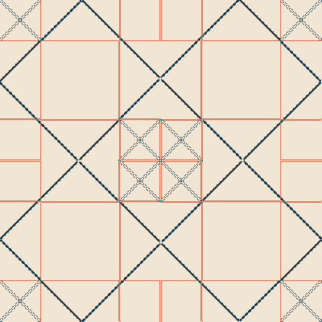

---

## What is this?

Murmur is an interactive gallery of cellular automata simulations. Each piece starts from a mathematical rule — majority voting, cyclic dominance, group theory — and produces striking visual patterns through emergence alone. No randomness is scripted; the complexity comes from simple local interactions repeating across a grid.

Browse the gallery, pick a piece, watch it evolve.

---

## Gallery

### Majority

Cells adopt their neighbors' majority opinion. Domains form, boundaries negotiate, consensus emerges.

| 3 States | Diagonal | Strong Consensus |
|----------|----------|------------------|
| 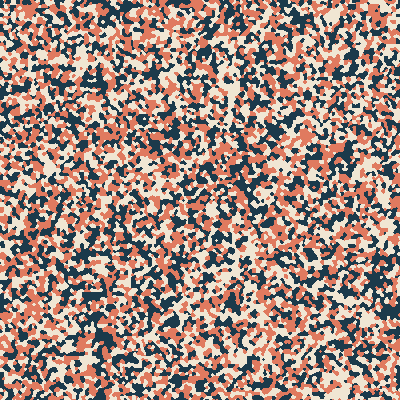 | 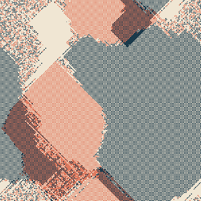 | 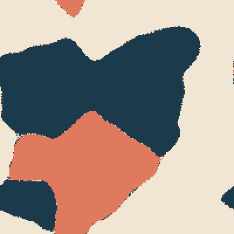 |

### Rock-Paper-Scissors

Cyclic dominance — each state beats one and loses to another. No equilibrium, just perpetual waves.

| 3 States | 5 States | 10-Party Cascade |
|----------|----------|------------------|
|  | 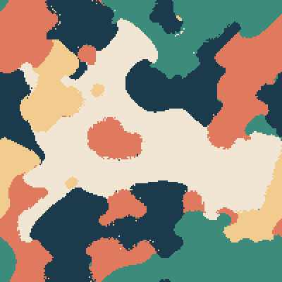 | 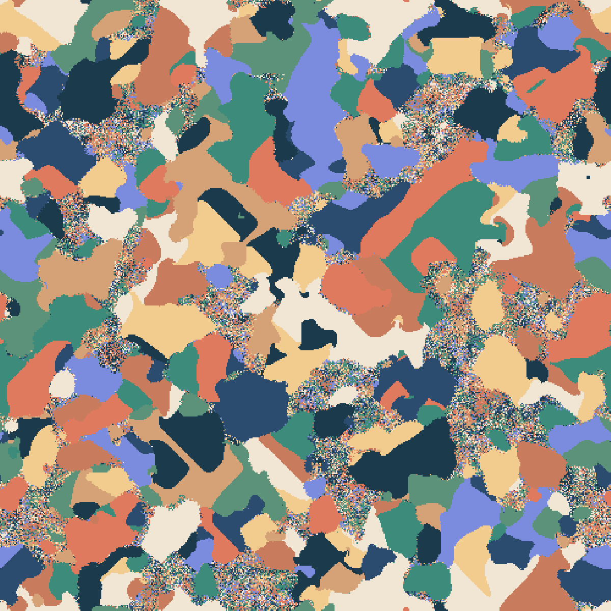 |

### Genetic Drift

Random resampling without selection pressure. Colors wander, merge, and slowly vanish.

| Local Drift | Hybrid (Local x Global) |
|-------------|------------------------|
| 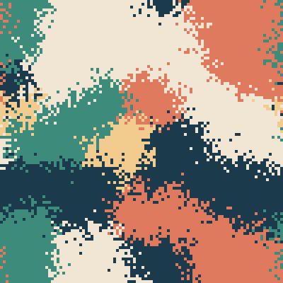 |  |

### Group Theory

Cells carry algebraic elements. Neighborhood products drive dynamics through non-commutative and symmetric structures.

| Imaginary Quadrants | Quaternion Pizza | Quaternion Spiral |
|---------------------|------------------|-------------------|
|  |  | 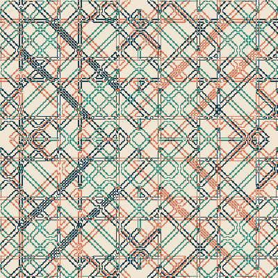 |

| D3 (Triangle) | D6 (Hexagon) | C4 (Cyclic) |
|----------------|--------------|-------------|
| 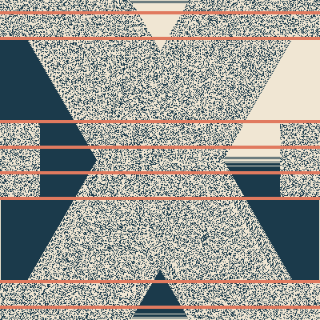 | 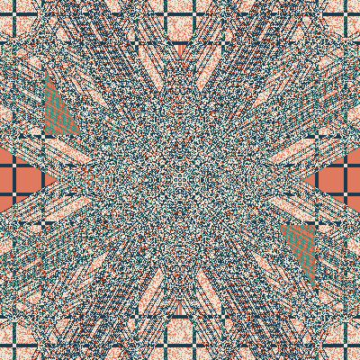 | 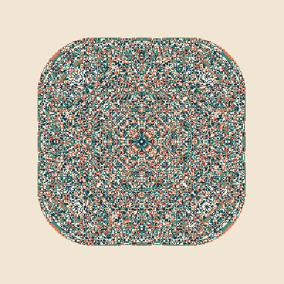 |

---

## Usage

Open `index.html` in a browser. Click any piece to enter the exhibit view and watch it run.

```
# No build step required — just open index.html
```

### Controls

The exhibit view uses minimal floating controls:

- **Play/Pause** — start or pause the simulation
- **Step** — advance one generation
- **Reset** — reinitialize to a fresh random state
- **Palette** — open the color editor to customize colors or try preset palettes

Controls auto-hide after 3 seconds of inactivity.

### Admin mode

Append `?admin=true` to the gallery URL to see all scenarios (including non-curated ones) and manage curation.

---

## Commands

```bash
# Run tests (Jest + jsdom)
npm test

# Generate a single thumbnail
npm run thumbnail <rule-id> [iterations] [canvas-size]

# Generate all thumbnails
npm run thumbnails:all
```

---

## Architecture

```
index.html          Gallery page (curated grid)
play.html           Exhibit view (full-bleed simulator)
scenarios.js        Scenario definitions + curation metadata

core/
  Rule.js           Abstract base class for rules
  Automaton.js      Drives rule application per generation
  Matrix.js         Flat 1D array with 2D interface, toroidal wrapping

rules/              20 rule implementations
  index.js          Registry + metadata

drawing/
  DrawingEngine.js  Canvas renderer (cell value -> color -> pixel)

ui/
  PlayControls.js   Play/pause/step/reset (icon-based)
  AutoHide.js       Auto-hide controls after inactivity
  ColorOverride.js  Runtime color remapping (no rule changes)
  PalettePanel.js   Slide-in color editor + presets
  State.js          Event dispatcher for simulation lifecycle
  icons.js          Inline SVG icon constants

murmur-tokens.css   Design tokens (colors, spacing, typography)
murmur-gallery.css  Gallery page styles
murmur-play.css     Exhibit view styles
```

### Data flow

`play.html` -> `initSimulation()` -> `getRuleById()` creates Rule -> `Automaton` + `ColorOverride` + `DrawingEngine` initialized -> `PlayControls` handles input -> `Controller.step()` -> `Rule.nextValue()` -> `ColorOverride.getColor()` -> `DrawingEngine.draw()`

---

## Adding a new rule

1. Create `rules/YourRule.js` extending `Rule`, implement `nextValue(row, col, state)`
2. Register in `rules/index.js` (add to `RULES` map and `RULE_META`)
3. Add scenario(s) in `scenarios.js` with display config
4. Mark as `curated: true` with a `sortOrder` to feature in the gallery
5. Add tests in `tests/rules/`

---

## Design

Murmur uses a dark gallery aesthetic — the UI recedes, the automata provide all the color.

- **Typography**: Space Grotesk (display) + Inter (body)
- **Palette**: Monochromatic zinc scale, no colored accents
- **Light mode**: Follows `prefers-color-scheme` automatically
- **Motion**: Respects `prefers-reduced-motion`

---

## License

MIT
